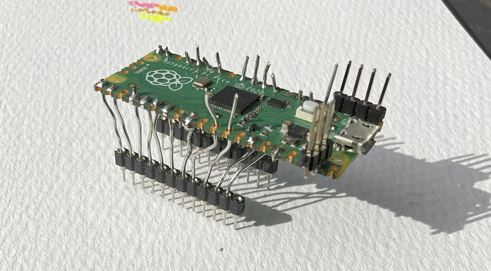
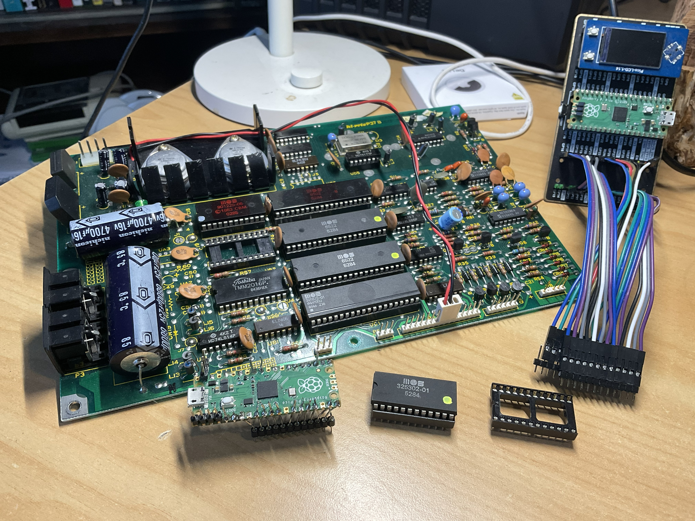
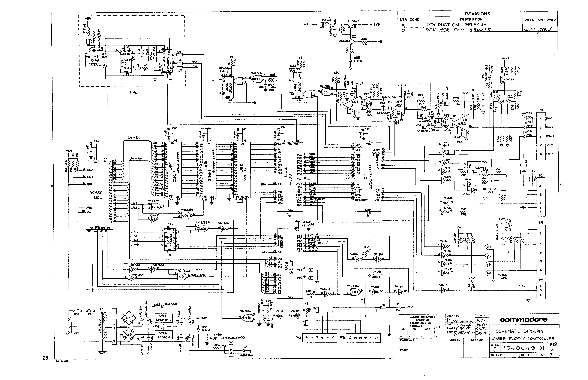

[](https://opensource.org/licenses/MIT) 



# nitrologic romulon 0.5

## Catching the 8 bit bus the IC formerly known as UB3



## 1541 schematic



## Pinouts

### 6502

bits   | pins
-------|----------
a0..11 | 9..20
vss    | 21
d7..d0 | 26..33
R/W    | 34

### 2364 rom socket

bits    | pins
--------|----------
a7..a0  | 1..8
d0..d2  | 9..11
gnd     | 12
d3..d7  | 13..17
a11..a10| 18..19
CS      | 20
a12     | 21
a9..a8  | 22..23
vcc     | 24

## part descriptions

```
[
  {
    "partNumber": "325302-01",
    "addressSpace": "$C000–$DFFF",
    "description": "Commonly known as the DOS Low ROM. This 8 KB chip contains the core Commodore DOS file management routines, command parsing logic, and LED status controls. Because it was highly stable from the early production days of the long-board drives, it was carried over unchanged into the short-board revisions."
  },
  {
    "partNumber": "901229-05",
    "addressSpace": "$E000–$FFFF",
    "description": "Known as the DOS High ROM or drive Kernal. This chip contains the critical serial bus communication handlers, low-level disk formatting controllers, and vector tables. It was engineered specifically for the short board to resolve timing bugs and sync issues inherent to the redesigned, cost-reduced motherboard layout."
  }
]
```
